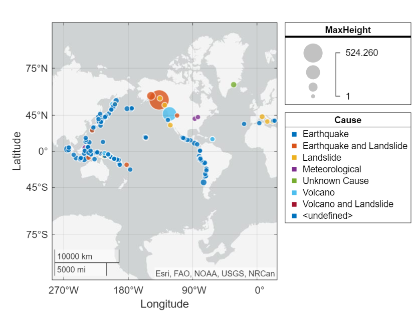
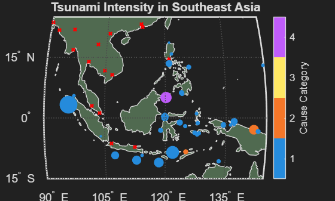
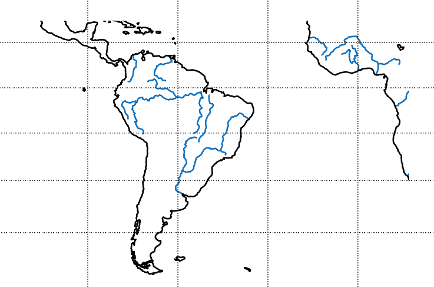
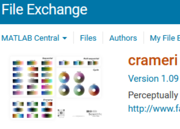

# RoadmaptoMapping
Workshop to explore geospatial data and mapping techniques in MATLAB!

[](https://matlab.mathworks.com/open/github/v1?repo=drLKeen/RoadmaptoMapping&file=MainWorkshopMenu.mlx)


<a id="T_1fc2"></a>

# Mapping and Data Analysis Workshop
<a id="H_89eb"></a>

# Introduction

This is a repository of notebooks and scripts that teach users how to manipulate and display geospatial information in MATLAB. The concepts and apps demonstrated here can apply to any field but are specifically designed for common geoscientific mapping needs.

<a id="H_45b3"></a>

# Getting Started

Choose one of the worksheets from below to get started. It is strongly suggested to do the worksheets in order, as each worksheet relies on files created or loaded in previous worksheets.


```matlab
addpath("Data\","Solutions\","Worksheets\")
```
# Worksheets

Choose the workshop materials that you want to complete based on the time you have available. Worksheet 1 provides an overview of essential plotting functionality and map custimizaiton and is usually a good place to start. The other worksheets delve deeper into different MATLAB mapping functionality. 

## Worksheet 1 \- [A Roadmap for Geospatial Mapping](./Worksheets/Worksheet1.mlx) (25 minutes)
||||
| :-- | :-- | :-- |
|  | Key concepts  | Toolboxes   |
|   | • basics of making maps and plotting geospatial data in MATLAB <br> • introduction to variety of map types and projections  | • Mapping Toolbox   |

<a id="H_28e9"></a>

## Worksheet 2 \- [Geospatial Data Files and Displays](./Worksheets/Worksheet2.mlx) (15 minutes)
||||
| :-- | :-- | :-- |
|  | Key concepts  | Toolboxes   |
|   | • scattered data, map projections, shape files, more customizations  | • Mapping Toolbox   |

<a id="H_8540"></a>

## Worksheet 3 \- [Saving, Importing, and Exporting Files and Figures](./Worksheets/Worksheet3.mlx) (10 minutes)
||||
| :-- | :-- | :-- |
|  | Key concepts  | Toolboxes   |
|   | • save, load/import, export <br> common file types  | • n/a   |

## Worksheet 4 \- [Accessing More Resources](./Worksheets/Worksheet4.mlx) (10 minutes)
||||
| :-- | :-- | :-- |
|  | Key concepts  | Toolboxes   |
|   | • File Exchange, <br> installation via addons toolstrip <br> • Source Control Integration <br> • Other links and resources!  | • n/a   |


*© 2025 The MathWorks, Inc*


*Last updated: 5/19/25 by Dr. Laura Keen*

